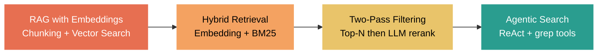
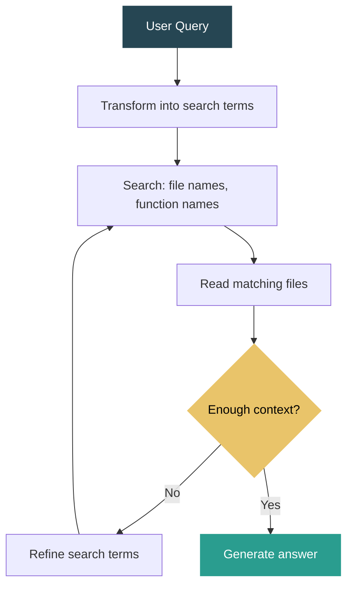

Why Claude Code Works — And Why You Might Not Need RAG (Embedding) Anymore

I've spent the past year and a half building LLM-powered applications, from early RAG (embedding) pipelines to agentic coding workflows. Here's what I've learned about why Claude Code succeeds where traditional embedding-based RAG often struggles.

Here's the journey at a glance:

I started with chat-with-file systems, mostly PDFs. Embedding-based retrieval felt like the obvious approach. It was meant to solve two fundamental LLM limitations: context length and the needle-in-a-haystack problem.

We went deep. We tried multiple chunking strategies — fixed-size, semantic, document-layout-aware using Azure Document Intelligence and AWS Textract. Those tools gave us rich metadata like headers, paragraphs, tables, structural hierarchy. From there, I proposed what I called hierarchical chunking. Instead of dumping everything into a single flat pool, we organized chunks into multiple structured pools. The intuition is simple: when you go to a library to find a book, you don't search every shelf. You start with the category, the author, narrow the scope first. And it worked.

For retrieval, we combined embedding search with keyword search like BM25, plus query transformation. Honestly, in most cases, keywords did the heavy lifting. Embeddings helped, but not as much as you'd expect.

Then I started questioning the core assumption behind all of this. We assume the embedding space is a good enough representation of our documents. Query goes to embedding, chunk goes to embedding, then we compare them with cosine similarity. But the problems stack up. Threshold tuning is painful — whether you pick by similarity score or top-N, neither is reliable across diverse queries. And embeddings, for all their strengths, miss domain-specific nuance and structural context.

We tried a smarter two-pass approach: get the top 100 candidates first, then use an LLM to filter for the truly relevant chunks before generating the answer. It helped, but it also made it clear we were just patching around a fundamentally lossy retrieval step.

Then Claude Code came along and changed how I think about this.

I've been using it for almost a year. It has boosted my productivity a lot — I've shipped more in the last year than I expected. At first, I was very explicit: referencing specific folders and files, planning every step, defining conventions upfront. Over time, I realized that with well-structured CLAUDE.md files, custom skills, and clear conventions per folder, you can just hand it the requirements and get solid implementations back.

But the real insight came when I looked at how Claude Code actually retrieves information. Here's the comparison:

| Approach | RAG (Embedding) | Claude Code (Agentic) |
|---|---|---|
| Retrieval method | Cosine similarity on embeddings | Iterative grep/glob + reasoning |
| Preprocessing | Chunking, embedding, indexing | None |
| Infrastructure | Vector DB, embedding model | Search tools only |
| Relevance tuning | Threshold / top-N / reranker | Model reasons over results |
| Handles ambiguity | Poorly (static similarity) | Well (multi-step refinement) |
| Setup complexity | High | Low | It uses grep, glob, and file reads — basic search primitives. No vector database, no embedding model. When you ask it to find something in a codebase, it transforms your query into multiple search terms, searches iteratively across file names, function names, then code content, and reasons over the results to decide what to look at next.

Here's what that loop looks like:

This is essentially ReAct — Reasoning plus Acting. The same pattern we experimented with early on using LangChain with GPT-3.5 and GPT-4. Back then, every turn went into the scratchpad, and the next call used all that accumulated context to derive the answer. But the models weren't capable enough. It was brittle. So we moved to LangGraph for more deterministic flows — explicit state, routing, model switching per node. I also built information-gathering agents that worked like interactive forms: the agent keeps asking questions until all required fields are filled. These patterns had their place.

But the key difference now is model capability. With stronger models and longer context windows, that simple loop of search, read, reason, search again — it just works. No complex orchestration needed.

Recently, I started a new chat-with-file project. Inspired by Claude Code, I skipped the entire embedding pipeline. Just a ReAct agent with a grep-like search tool.

It works remarkably well. No chunking strategies. No embedding models. No similarity thresholds. No vector databases. Just a capable model, a search tool, and the ability to reason over what it finds.

I'm not saying RAG (embedding) is dead. There are real use cases for vector search at scale. But for many applications, especially with structured or semi-structured documents, the simplest agentic approach can outperform a sophisticated retrieval pipeline.

The lesson: don't start with the most complex architecture. Start with a capable model, give it the right tools, and let it reason.

What's your experience? Have you moved away from traditional RAG toward agentic approaches? I'd love to hear what's working for you.

References:
- Claude Code: https://docs.anthropic.com/en/docs/claude-code
- ReAct pattern: https://arxiv.org/abs/2210.03629
- LangChain ReAct: https://python.langchain.com/docs/how_to/migrate_agent/
- LangGraph: https://langchain-ai.github.io/langgraph/
- Azure Document Intelligence: https://learn.microsoft.com/en-us/azure/ai-services/document-intelligence/
- AWS Textract: https://aws.amazon.com/textract/
- BM25 (Okapi): https://en.wikipedia.org/wiki/Okapi_BM25
