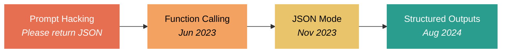
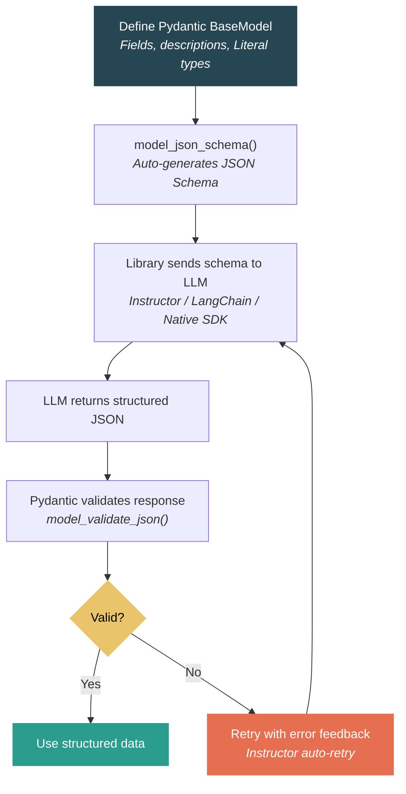

From Prompt Hacks to Structured Output — How LLMs Learned to Speak JSON

When you build software, almost everything speaks JSON. APIs, configs, databases, frontend-backend communication — it's all JSON. So when LLMs came along and could only return free-form text, the first thing we all wanted was: can you just give me a JSON object?

At the beginning, the answer was no. Not natively. So we hacked around it. We injected prompts like "You must output your response in JSON format", followed by a JSON schema and sample data. Sometimes it worked. Sometimes the model added extra text before or after the JSON. Sometimes it hallucinated field names or got the types wrong. We had to parse, validate, retry. It was fragile.

Then OpenAI changed the game. Here's how the evolution unfolded:

| Feature | Prompt Hack | Function Calling | JSON Mode | Structured Outputs |
|---|---|---|---|---|
| Date | Pre-2023 | Jun 2023 | Nov 2023 | Aug 2024 |
| Valid JSON | No guarantee | Best-effort | Guaranteed | Guaranteed |
| Schema enforced | No | Best-effort | No | Strict (constrained decoding) |
| How it works | Prompt injection | Define functions with JSON Schema | Set response_format | Strict mode with exact schema |
| Reliability | Low | Medium | Medium-high | Very high |

In June 2023, OpenAI introduced function calling with GPT-3.5 and GPT-4. The idea was simple: you describe functions with a name, description, and parameters defined in JSON Schema. The model returns a structured function call with arguments that follow your schema. It wasn't perfect — the model could still produce invalid output — but it was the first time we had a formal mechanism to guide the model toward structured responses.

A few months later, in November 2023, OpenAI launched JSON mode with GPT-4 Turbo. You set response_format to json_object, and the model guarantees valid JSON. But here's the catch — it guarantees valid JSON, not your JSON. There's no schema enforcement. You still need to describe the structure you want in the prompt and hope the model follows it.

The real breakthrough came in August 2024 with Structured Outputs on GPT-4o. This introduced strict mode — constrained decoding that guarantees the model's output validates against your exact JSON Schema. Not best-effort, not "usually works" — actually guaranteed. For me, this was the game changer. It means we can now use LLMs like regular functions: define the input, define the output schema, and get back data that fits.

Anthropic took a different path. Claude supports tool use since April 2024 with the Claude 3 family. The approach is: define a tool whose schema matches your desired output, force the model to call that specific tool, and extract the structured input. It doesn't have constrained decoding like OpenAI's strict mode, but with forced tool use it works reliably in practice.

Google Gemini added function calling in December 2023 and later added response_schema support for structured output. The ecosystem converged — everyone recognized that structured output is essential.

Provider support across the ecosystem:

| Provider | Function Calling | JSON Mode | Strict Structured Output |
|---|---|---|---|
| OpenAI | Jun 2023 (GPT-3.5/4) | Nov 2023 (GPT-4 Turbo) | Aug 2024 (GPT-4o) |
| Anthropic | Apr 2024 (Claude 3) | Via forced tool use | Via forced tool use |
| Google Gemini | Dec 2023 | response_schema (late 2024) | response_schema |

Now, about the libraries.

I started with LangChain. The main appeal was prompt management and provider abstraction. If you wanted to switch from OpenAI to Claude to Bedrock, you didn't need to rewrite everything — just change the config. That's genuinely useful. LangChain supports structured output through with_structured_output(), which uses each provider's native mechanism under the hood.

But I ran into the limitation. When I was working with AWS Bedrock to use Claude for structured output, LangChain didn't have the latest version support. New features from LLM providers take time to surface in LangChain. Schema conversion can lose nuances. Debugging is harder because you can't easily see what's actually being sent to the API. That's the trade-off with any unified abstraction — you get portability, but you lose control and freshness.

If you're committed to a single LLM provider, using their native SDK gives you more control, faster access to new features, and fewer surprises. If you need to support multiple providers, the abstraction layer makes sense. It's pros and cons.

| Library | Approach | Pros | Cons |
|---|---|---|---|
| Native SDK | Direct provider API | Full control, latest features | Provider lock-in, different API per provider |
| LangChain | Unified abstraction | Portability, prompt management | Lags behind providers, harder to debug |
| Instructor | Pydantic-first, patches SDK | Retry logic, cross-provider, keeps SDK access | Extra dependency |

That's when I switched to Instructor.

Instructor, created by Jason Liu, took a different approach. Instead of abstracting the entire LLM interaction, it focuses on one thing: getting structured output via Pydantic models. You define your output as a Pydantic BaseModel, and Instructor handles converting the schema, making the API call (using tool use or JSON mode under the hood), parsing the response, and retrying with validation errors fed back to the model if something goes wrong. That retry loop was especially valuable before strict structured outputs existed — the model could see exactly what went wrong and fix it.

It supports all major providers: OpenAI, Anthropic, Google, Mistral, Groq, Together, Ollama, and more. And it patches the native SDK rather than replacing it, so you keep full access to provider-specific features.

The schema definition side has converged on Pydantic, and I think that's the right choice. If you work with Python, you probably already use Pydantic — it's the standard for FastAPI, SQLAlchemy integrations, data validation everywhere.

For LLM structured output, Pydantic gives you everything you need. Field descriptions that flow into the JSON Schema and help the model understand what to produce. Literal types for categorical fields — if a field should be "positive", "negative", or "neutral", you define it as Literal["positive", "negative", "neutral"] and the model is forced to pick from that list. Default values, optional fields, nested models, lists, validators — it all translates to JSON Schema that the model can follow.

Here's how the pieces fit together:

The model_json_schema() method generates the schema. Libraries like Instructor call it automatically. You write Python, and the structured output just works.

Looking back, the progression was clear:

Prompt hacking — "please return JSON" and pray.
Function calling (June 2023) — schema-guided but best-effort.
JSON mode (November 2023) — guaranteed valid JSON, but no schema enforcement.
Structured Outputs (August 2024) — guaranteed schema compliance via constrained decoding.

Each step removed a layer of uncertainty. We went from hoping the model cooperates to knowing the output conforms. That's a fundamental shift — it turns LLMs from text generators into programmable functions.

The libraries evolved alongside this. Early on, you needed Instructor's retry logic to compensate for unreliable output. Now with strict structured outputs, the model gets it right on the first try. But Instructor and similar tools still add value — cross-provider support, Pydantic integration, clean API. They let you focus on defining what you want instead of wrestling with each provider's API format.

If you're building LLM-powered applications and you're still parsing free-text output with regex, stop. Structured output is mature, widely supported, and it makes your code dramatically simpler and more reliable.

What tools are you using for structured output? I'd love to hear what's working in your stack.

References:
- OpenAI Function Calling: https://platform.openai.com/docs/guides/function-calling
- OpenAI Structured Outputs: https://platform.openai.com/docs/guides/structured-outputs
- Anthropic Tool Use: https://docs.anthropic.com/en/docs/build-with-claude/tool-use
- Google Gemini Function Calling: https://ai.google.dev/gemini-api/docs/function-calling
- Instructor: https://python.useinstructor.com/
- LangChain Structured Output: https://python.langchain.com/docs/how_to/structured_output/
- Pydantic: https://docs.pydantic.dev/latest/
- AWS Bedrock Converse API: https://docs.aws.amazon.com/bedrock/latest/userguide/conversation-inference.html
