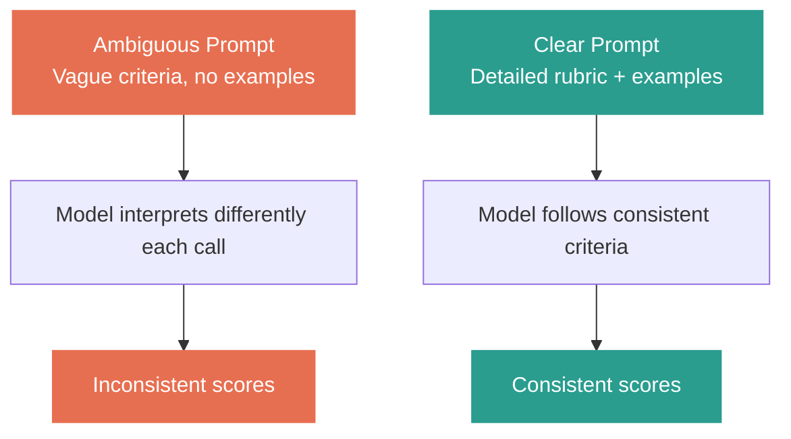
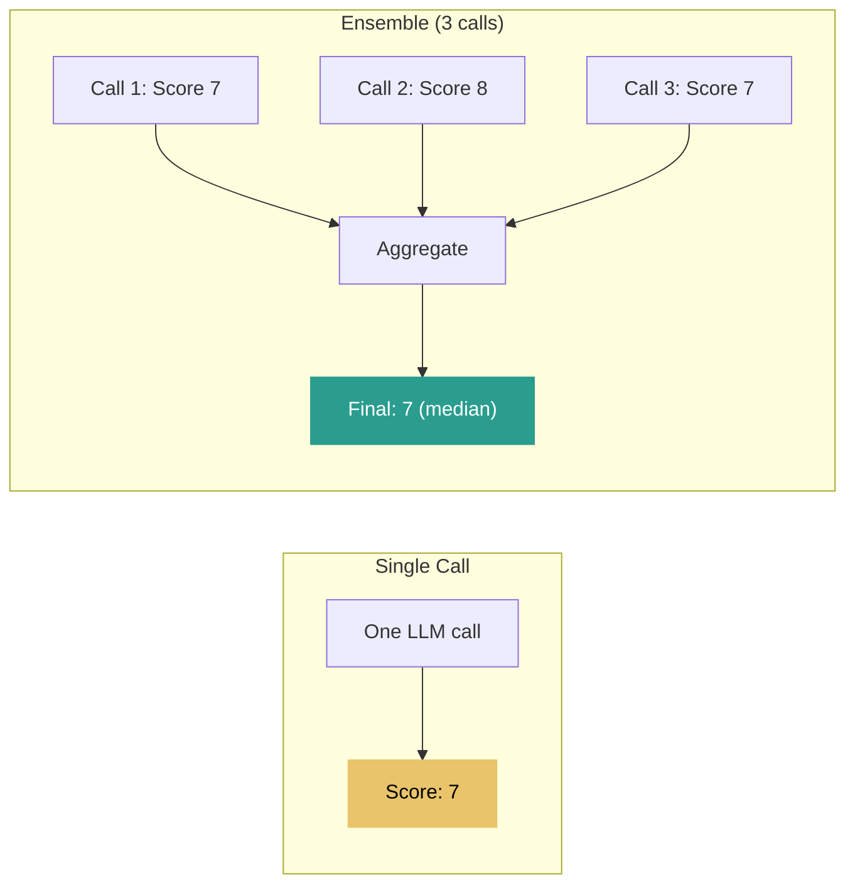
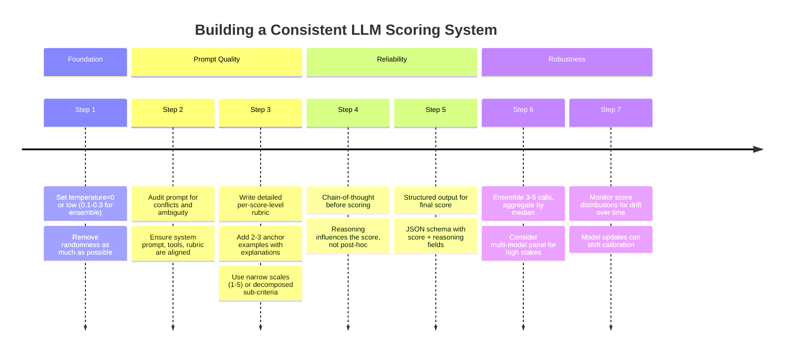

How to Make LLM Output Consistent — Lessons from Building a Scoring System

If you've worked with LLMs long enough, you've hit this problem: you run the same prompt twice and get different results. For a chatbot, that's fine. For a scoring system where you need reliable, repeatable judgments? It's a real problem.

I've worked on a project using LLM as a judge — a scoring system. Here's everything I've learned about making LLM output consistent.


The first thing most people reach for is temperature. Set it to 0, problem solved, right? Not quite.

Temperature=0 means greedy decoding — the model always picks the highest-probability token. It's the most deterministic setting available, but it's not truly deterministic. GPU floating-point operations are inherently non-deterministic due to parallel reduction — different thread execution orders produce slightly different rounding, which can flip the result when two tokens have near-identical probabilities.

OpenAI introduced a seed parameter in late 2023. When you set seed + temperature=0, they aim for deterministic outputs and return a system_fingerprint. But their docs explicitly say it's "best effort." Backend changes, model updates, load balancing across different hardware — all can break reproducibility. In practice, users report 85-95% reproducibility, not 100%.

Anthropic doesn't expose a seed parameter at all. Temperature=0 with greedy decoding is the best you get.

| Parameter | What it does | Deterministic? |
|---|---|---|
| temperature=0 | Greedy decoding, always picks top token | Nearly, but GPU non-determinism remains |
| temperature=0 + seed (OpenAI) | Best-effort determinism with fingerprint tracking | ~85-95% reproducible |
| top_p=1 + temperature=0 | top_p has no effect at temp 0 | Same as temperature=0 |
| Low temperature (0.1-0.3) | Reduces randomness while keeping some diversity | No, but useful for ensembles |

Bottom line: temperature helps, but alone it's not enough for a reliable scoring system.


The second and most overlooked thing is prompt quality. If your instructions have contradictions or ambiguity, the model will be inconsistent — not because it's random, but because it's interpreting unclear guidance differently each time.



Check for conflicts between your system prompt and tool descriptions. If the system prompt says "be strict" and a tool description says "be lenient," the model is stuck. This connects directly to what I wrote about in my prompt priority post — conflicting instructions at the same priority level create inconsistency.

Also check between your rubric criteria. If criterion A rewards brevity and criterion B rewards thoroughness, the model will oscillate. Make your criteria independent and non-contradictory.


The third technique is what made the biggest difference for me: detailed rubrics with per-score-level descriptions.

If you tell the model "score from 0 to 10," you'll get inconsistent results. The model's idea of a 6 versus a 7 is fuzzy. But if you define exactly what each score range means, consistency improves dramatically.

The Prometheus paper (Kim et al., ICLR 2024) showed this rigorously — providing explicit score-level descriptions significantly outperformed generic "rate from 1-5" prompts.

Here's how I structure it:

```
Score 0-1: Completely irrelevant or factually wrong. The response does not address the question at all.
Score 2-3: Partially relevant but has major errors or significant missing information.
Score 4-5: Addresses the question but lacks depth. May have minor inaccuracies.
Score 6-7: Good response. Accurate, relevant, covers the main points with reasonable depth.
Score 8-9: Excellent response. Comprehensive, accurate, well-structured, adds meaningful insight.
Score 10: Exceptional. Could not be meaningfully improved. Fully addresses every aspect of the question.
```

Each level has observable, objective criteria — not just "good" versus "bad." The model now has clear anchors.

A few calibration tips from research:

| Technique | Impact on consistency |
|---|---|
| Detailed per-level rubric | High — the single most effective technique |
| 2-3 anchor examples with explanations | High — few-shot calibration teaches the scale |
| Narrower scale (1-5 vs 1-10) | Medium — less ambiguity between adjacent scores |
| Independent sub-criteria scored separately | Medium — reduces conflation of different quality aspects |
| Boundary examples ("this is a 3, this is a 4 because...") | High — resolves edge cases |

One important note: narrower scales (1-5) are generally more reliable than wider scales (1-10) for LLMs. The distinction between a 6 and a 7 on a 10-point scale is often too fuzzy. If you need fine granularity, decompose into multiple sub-criteria scored on narrow scales, then aggregate.


The fourth technique is ensemble — instead of trusting a single call, run multiple calls and aggregate.



The Self-Consistency paper (Wang et al., ICLR 2023) showed that sampling multiple reasoning paths and taking majority vote significantly improves accuracy. The same principle applies to scoring.

| Aggregation method | Best for | Notes |
|---|---|---|
| Mean | Continuous scores | Simple but outlier-sensitive |
| Median | Continuous scores | Robust to outliers, my preferred approach |
| Majority vote | Categorical (pass/fail, A/B/C) | Best for discrete judgments |
| Trimmed mean | Continuous, high stakes | Drop highest and lowest, average the rest |

Practical notes on ensembling:

3 calls captures most of the variance reduction. Going to 5 helps a bit more. Beyond 5 is rarely justified unless the stakes are very high.

When ensembling, use a small positive temperature (0.2-0.3) instead of 0. At temperature=0, if the output were truly deterministic, you'd get the same answer N times — useless. A small temperature introduces useful diversity across calls.

You can also ensemble across models — GPT-4 + Claude + Gemini. Different models have different biases, so a multi-model panel is more robust than repeating the same model. This is what the ChatEval paper (Chan et al., 2023) explored.


One more thing worth knowing: chain-of-thought before scoring improves consistency significantly.

The G-Eval paper (Liu et al., 2023) showed that having the model reason through evaluation criteria before assigning a score improved correlation with human judgments substantially — Spearman correlation went from ~0.38 to ~0.51 on summarization tasks.

The key is that reasoning must come before the score, not after. If the model outputs the score first and then explains, the explanation is just post-hoc rationalization. If it reasons first and then scores, the reasoning actually influences the judgment.

The optimal pattern is: chain-of-thought reasoning + structured output for the final score.

```
Think step by step:
1. [model evaluates against criterion A]
2. [model evaluates against criterion B]
3. [model evaluates against criterion C]

{"score": 7, "reasoning": "summary of above"}
```


And finally, be aware of the known biases in LLM scoring:

| Bias | What happens | Mitigation |
|---|---|---|
| Position bias | Prefers the first response in pairwise comparison | Swap order, average both results |
| Verbosity bias | Rates longer responses higher, even if redundant | Instruct judge to ignore length; normalize |
| Self-preference bias | Rates its own model's output ~10% higher | Use a different model as judge |
| Format/style bias | Prefers markdown, bullet points over plain text | Normalize formatting before judging |
| Anchoring bias | Hints about expected quality skew the score | Remove metadata, anonymize outputs |

For pairwise comparisons specifically, always present each pair in both orders (A/B and B/A) and average. If both orders agree, high confidence. If they disagree, flag as uncertain.


Putting it all together, here's my recommended stack for a reliable LLM scoring system:



Each layer adds consistency. You don't need all of them for every use case — but for a production scoring system, I'd use at least steps 1-5.

What techniques are you using for LLM consistency? Have you run into the same issues?


References:
- Judging LLM-as-a-Judge with MT-Bench (Zheng et al., NeurIPS 2023): https://arxiv.org/abs/2306.05685
- The Instruction Hierarchy (OpenAI, 2024): https://arxiv.org/abs/2404.13208
- Self-Consistency Improves Chain of Thought Reasoning (Wang et al., ICLR 2023): https://arxiv.org/abs/2203.11171
- G-Eval: NLG Evaluation using GPT-4 with Chain-of-Thought (Liu et al., 2023): https://arxiv.org/abs/2303.16634
- Prometheus: Inducing Fine-Grained Evaluation Capability (Kim et al., ICLR 2024): https://arxiv.org/abs/2310.08491
- Large Language Models are not Fair Evaluators (Wang et al., ACL 2024): https://arxiv.org/abs/2305.17926
- ChatEval: Multi-Agent Debate (Chan et al., 2023): https://arxiv.org/abs/2308.07201
- OpenAI API Seed Parameter: https://platform.openai.com/docs/guides/text-generation
