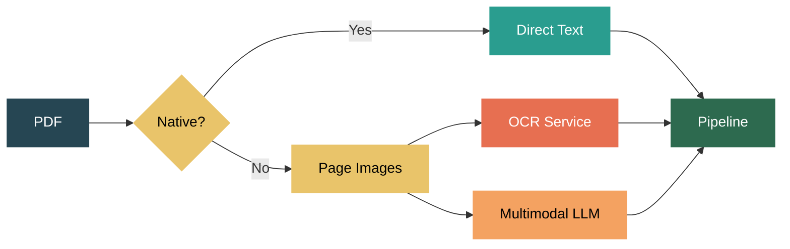

PDF Meets LLM — The Tools, Trade-offs, and Pricing of Document Processing

PDF processing was one of the first things I worked on as an AI engineer. Back then it was all about OCR pipelines — extract text, parse structure, feed it into whatever downstream system needed it. Now with multimodal LLMs, the landscape has shifted. You can send a document page as an image and ask the model to understand it. But that doesn't mean OCR is dead — far from it.

Here's what I've learned about the tools, trade-offs, and real costs of processing PDFs in the age of LLMs.


The first decision in any PDF pipeline: is the document native or scanned?

Native PDFs (digitally created) have embedded text. You can extract it directly — no OCR, no LLM, no cost. This is always the first thing I check, because if the text is already there, everything else is unnecessary overhead.

Scanned PDFs are just images wrapped in a PDF container. There's no text layer. You need either OCR or a multimodal LLM to read them.




For native PDFs, the Python ecosystem has solid tools. Here's a quick comparison of what I've used:

| Tool | Type | Best for | Notes |
|---|---|---|---|
| PyMuPDF (fitz) | Python library | All-in-one (text + manipulation + rendering) | Fast C engine, no external deps |
| pikepdf | Python library | Low-level PDF surgery, repair, linearization | Built on qpdf, handles corrupted PDFs |
| pypdf | Python library | Simple merge/split/encrypt | Pure Python, was PyPDF2, lightweight |
| ReportLab | Python library | Creating PDFs from scratch | Reports, invoices, charts |
| pdftk | CLI tool | Quick merge/split/rotate/encrypt | The classic, Java dependency |
| qpdf | CLI tool | Page manipulation, repair, linearization | Lightweight, no Java |
| Ghostscript | CLI tool | Compression, format conversion, rendering | Powerful but slow for large batches |

For text extraction, PyMuPDF gives you plain text or line-by-line with bounding boxes (position, font, size). That bbox data is critical for structured extraction — invoices, forms, tables — where spatial position determines meaning.

pikepdf is excellent when you need to repair damaged PDFs, remove encryption, or do low-level PDF surgery. pypdf is the lightweight option when you just need simple merge/split and want zero C dependencies. For shell scripts, pdftk and qpdf handle most operations in one-liners.

```python
# PyMuPDF — text with bounding boxes
import fitz
doc = fitz.open("document.pdf")
for page in doc:
    blocks = page.get_text("dict")["blocks"]
    for block in blocks:
        if block["type"] == 0:
            for line in block["lines"]:
                for span in line["spans"]:
                    text, bbox = span["text"], span["bbox"]

# pikepdf — repair and decrypt
import pikepdf
pdf = pikepdf.open("damaged.pdf")
pdf.save("repaired.pdf")

# pypdf — simple merge
from pypdf import PdfReader, PdfWriter
writer = PdfWriter()
for page in PdfReader("input.pdf").pages:
    writer.add_page(page)
writer.write("output.pdf")
```

```bash
# CLI tools for shell workflows
pdftk doc1.pdf doc2.pdf cat output merged.pdf
qpdf --empty --pages doc1.pdf 1-5 doc2.pdf 3-10 -- merged.pdf
gs -dNOPAUSE -dBATCH -sDEVICE=pdfwrite -dPDFSETTINGS=/ebook \
   -sOutputFile=compressed.pdf input.pdf
```

My rule: PyMuPDF when I need text extraction + manipulation in the same pipeline. pikepdf for corrupted files. pypdf for minimal dependencies. pdftk/qpdf for shell one-liners.


One important preprocessing step before sending documents to any external service: redaction. When you're dealing with PII, financial data, or medical records, you want to black out sensitive content before it leaves your system.

PyMuPDF handles this properly — `apply_redactions()` actually removes the underlying content, not just covers it with a black rectangle. Some naive approaches just draw over the text, which means it's still extractable. Redact first, then extract — you never expose sensitive data to external APIs.


Now the interesting part: what happens when you need to process scanned documents, or when you want a model to understand the document rather than just read it?

This is where the PDF-to-image step becomes essential. Convert each page to an image, then send it to either an OCR service or a multimodal LLM. Every major LLM provider now supports image/document input, but they handle it very differently — and the pricing varies wildly.

```python
# Convert PDF pages to images for LLM/OCR processing
import fitz
doc = fitz.open("document.pdf")
page = doc[0]
pix = page.get_pixmap(dpi=300)
image_bytes = pix.tobytes("png")
# Now send image_bytes to any LLM or OCR service
```

I also use this approach with [AWS Textract [1]](https://aws.amazon.com/textract/pricing/) and [Azure Document Intelligence [2]](https://azure.microsoft.com/en-us/pricing/details/document-intelligence/). Both support sending entire documents for batch processing, but they can be slow for large documents. When you don't need comprehensive cross-page layout analysis, sending pages individually as images gives you better control over parallelism and error handling.


Let me break down how each provider handles document/image input and what it actually costs. This is important — you pay for both input tokens (the image) and output tokens (the extracted text). Most comparisons only show input cost, which is misleading.

For a typical document page, assume ~500 output tokens when extracting text as markdown (varies by content density).

**LLM providers — full cost of document text extraction per 1,000 pages:**

| Provider | Model | Input cost/M | Output cost/M | Input tokens/page | Est. total per 1K pages |
|---|---|---|---|---|---|
| [Google [3]](https://ai.google.dev/gemini-api/docs/pricing) | Gemini Flash 2.5 | $0.30 | $2.50 | ~250-500 | ~$1.35-1.40 |
| [OpenAI [5]](https://platform.openai.com/docs/pricing) | GPT-4o-mini | $0.15 | $0.60 | ~765-1,105 | ~$0.41-0.47 |
| [OpenAI [5]](https://platform.openai.com/docs/pricing) | GPT-4o | $2.50 | $10.00 | ~765-1,105 | ~$6.90-7.75 |
| [Anthropic [4]](https://docs.anthropic.com/en/docs/build-with-claude/vision) | Claude Haiku 4.5 | $1.00 | $5.00 | ~1,500-3,000 | ~$4.00-5.50 |
| [Anthropic [4]](https://docs.anthropic.com/en/docs/build-with-claude/vision) | Claude Sonnet 4.6 | $3.00 | $15.00 | ~1,500-3,000 | ~$12.00-16.50 |

A few important notes on how each provider calculates image tokens:

OpenAI divides images into 512×512 tiles in high detail mode — each tile costs 170 tokens plus an 85-token base. A typical document page (~1024×1024) is about 765 tokens. In low detail mode, any image is a flat 85 tokens regardless of size.

Anthropic's PDF processing is uniquely expensive because Claude extracts the text AND converts every page into an image — you pay for both. A 50-page document can consume 75,000-150,000 tokens just sitting in context.

Gemini treats each PDF page as one image with fixed token cost, making it the cheapest LLM option for document processing.

**How does LLM extraction quality compare?** The [OmniAI OCR benchmark [11]](https://getomni.ai/blog/ocr-benchmark) tested 9 providers on 1,000 documents. Gemini Flash achieved the best Character Error Rate (CER) among multimodal LLMs at 15%, compared to 25% for GPT-4o. Traditional OCR services like Azure and Textract still lead on pure text accuracy, but the gap has narrowed significantly — especially for printed text and standard layouts.

For complex tables and handwriting, OCR services still have an edge. But for standard printed documents, LLMs are now competitive and dramatically cheaper.

**OCR services — traditional text extraction:**

**AWS Textract (per 1,000 pages, US region):**

| Feature | First 1M pages | After 1M pages |
|---|---|---|
| Detect Text (OCR only) | $1.50 | $0.60 |
| Tables | $15.00 | $10.00 |
| Forms (key-value pairs) | $50.00 | $30.00 |
| Queries (custom questions) | $25.00 | $15.00 |
| Tables + Forms + Queries | $90.00 | $55.00 |

**Azure Document Intelligence (per 1,000 pages):**

| Model | Price per 1,000 pages |
|---|---|
| Read (OCR text extraction) | $1.50 |
| Layout (text + tables + structure) | $10.00 |
| Prebuilt (invoices, receipts, IDs) | $10.00 |
| Custom extraction | $25.00 |

Now the comparison is more honest. Gemini Flash 2.5 at ~$1.35/1K pages is comparable to basic OCR ($1.50/1K) — but you get document understanding, not just raw text. GPT-4o-mini at ~$0.41/1K is the cheapest overall. Claude Sonnet at ~$12-16.50/1K pages is 8-10x more expensive than basic OCR.


[Gemini's document understanding [3]](https://ai.google.dev/gemini-api/docs/pricing) is genuinely impressive for the price. The approach is simple: convert each page to an image, send it to Gemini, ask it to extract content as markdown.

```python
import google.generativeai as genai

model = genai.GenerativeModel("gemini-2.5-flash")

response = model.generate_content([
    "Extract all text from this document page in markdown format.",
    {"mime_type": "image/png", "data": image_bytes}
])
```

If this works for your use case, it's an incredibly affordable extraction path. But there's a catch: hallucination. When I ask Gemini (or any LLM) to extract text from images, sometimes it adds content that isn't there, misreads numbers, or reformats things in ways that change meaning.

For summarization or simple entity extraction — company name, date, total amount — LLM-based extraction is usually fine. The model understands the document well enough for high-level tasks.

For anything requiring exact text fidelity — legal documents, financial records, compliance workflows — I don't trust LLM-based extraction alone. That's where proper OCR services earn their cost. There's no hallucination risk with OCR — it either reads the character correctly or it doesn't. No invented content.


But here's the approach that actually works best for information extraction: OCR + LLM combined.

Instead of asking the LLM to both read and understand the document (image → LLM), you split the responsibilities: let OCR handle the reading, let the LLM handle the understanding.


The naive approach sends the image directly to an LLM and asks it to extract entities. The problem: the LLM is doing two things at once — OCR (reading pixels into text) and reasoning (understanding what the text means). When it fails, you don't know which step failed. Was the text misread, or was the logic wrong?

The combined approach separates these concerns:

1. OCR reads the text accurately (no hallucination)
2. LLM reasons over the accurate text (no vision errors)

```python
# Naive: image → LLM (does OCR + reasoning in one shot)
response = model.generate_content([
    "Extract invoice number, date, and total from this document.",
    {"mime_type": "image/png", "data": image_bytes}
])
# Risk: LLM might misread "l" as "1", hallucinate fields

# Better: OCR → text → LLM (separated concerns)
# Step 1: OCR for accurate text
ocr_text = textract_client.detect_document_text(image_bytes)

# Step 2: LLM for reasoning over accurate text
response = client.chat.completions.create(
    model="gpt-4o-mini",
    messages=[
        {"role": "system", "content": "Extract structured data from this OCR text."},
        {"role": "user", "content": f"Extract invoice number, date, total:\n\n{ocr_text}"},
    ]
)
```

This is significantly more robust. The OCR gives you reliable text — no hallucinated content, no misread numbers. The LLM then operates on text (which it's great at) instead of pixels (where it can stumble). And because you're sending text tokens instead of image tokens to the LLM, it's often cheaper too.

| Approach | OCR cost | LLM cost | Total per 1K pages | Accuracy |
|---|---|---|---|---|
| Image → LLM (naive) | $0 | ~$0.23-16.50 | ~$0.23-16.50 | Moderate (hallucination risk) |
| OCR → LLM (combined) | $1.50 | ~$0.05-0.50 (text only) | ~$1.55-2.00 | High (no vision errors) |
| OCR → LLM with structured output | $1.50 | ~$0.10-1.00 | ~$1.60-2.50 | Highest (validated schema) |

The sweet spot for production information extraction: basic OCR ($1.50/1K pages) + a cheap LLM like GPT-4o-mini for reasoning over the text. Total cost around $1.55-2.00 per 1K pages, and dramatically more reliable than the naive image-to-LLM approach.

For native PDFs, it's even better — replace the OCR step with direct text extraction (free), so you only pay for the LLM reasoning.


Here's my decision framework:

| Need | Approach | Cost per 1K pages | Why |
|---|---|---|---|
| Summarize a document | Gemini Flash 2.5 or GPT-4o-mini | ~$0.41-1.35 | Cheapest, good enough for understanding |
| Extract text as markdown | Gemini Flash 2.5 or GPT-4o-mini | ~$0.41-1.35 | Competitive quality, comparable to OCR cost |
| Robust entity extraction | OCR + GPT-4o-mini (text) | ~$1.55-2.00 | OCR accuracy + LLM reasoning, best trade-off |
| High-quality understanding | Claude Sonnet or GPT-4o | ~$7-17 | Best reasoning, most expensive |
| Exact text from native PDFs | PyMuPDF / pypdf (direct) | Free | No OCR needed, perfect fidelity |
| Exact text from scanned docs | Textract or Azure (Read) | $1.50 | Reliable OCR, no hallucination |
| Table extraction | Textract or Azure (Layout) | $10-15 | Structured output with positions |
| Forms and key-value pairs | Textract or Azure (Forms) | $10-50 | Accurate but expensive |
| Compliance-critical extraction | OCR service + human review | $1.50-50 | No hallucination risk |

The key insight: always check if the PDF is native first. If it is, you get perfect text extraction for free. For scanned documents, choose based on your accuracy needs and budget — LLM for understanding, OCR for fidelity.


One more practical consideration: when working with OCR services like Textract and Azure Document Intelligence, they support batch processing of entire documents with cross-page layout understanding — recognizing that a table spans two pages, or that a header on page 1 applies to content on page 2. This is valuable but slow.

If you don't need that cross-page intelligence, convert pages to images individually and send them one at a time. This gives you better control over parallelism, error handling (retry just the failed page), and cost (skip pages you don't need). It's the approach I use most often in production.

What's your PDF processing stack? Are you using LLM-based extraction, or sticking with traditional OCR?


References:

[1] ["Amazon Textract — Pricing."](https://aws.amazon.com/textract/pricing/) AWS.  
[2] ["Azure Document Intelligence — Pricing."](https://azure.microsoft.com/en-us/pricing/details/document-intelligence/) Microsoft Azure.  
[3] ["Gemini Developer API — Pricing."](https://ai.google.dev/gemini-api/docs/pricing) Google AI.  
[4] ["Vision — Claude API."](https://docs.anthropic.com/en/docs/build-with-claude/vision) Anthropic.  
[5] ["Pricing."](https://platform.openai.com/docs/pricing) OpenAI.  
[6] ["Images and Vision."](https://platform.openai.com/docs/guides/images-vision) OpenAI.  
[7] ["PyMuPDF Documentation."](https://pymupdf.readthedocs.io/) Artifex.  
[8] ["pikepdf Documentation."](https://pikepdf.readthedocs.io/) pikepdf.  
[9] ["Amazon Textract — Features."](https://aws.amazon.com/textract/features/) AWS.  
[10] ["Document Intelligence — Layout Model."](https://learn.microsoft.com/en-us/azure/ai-services/document-intelligence/prebuilt/layout) Microsoft Learn.  
[11] ["OmniAI OCR Benchmark."](https://getomni.ai/blog/ocr-benchmark) OmniAI.  
