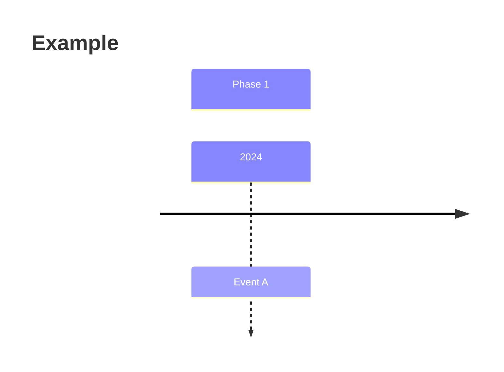

# Community Contributor Posts

A collection of LinkedIn posts discussing lessons learned from building LLM-powered applications.

## Structure

Each post has 3 versions:
- `NNN-<slug>.md` — full version (renders on GitHub with mermaid support)
- `NNN-linkedin-version.md` — short version for LinkedIn (under 3,000 chars)
- `_posts/YYYY-MM-DD-<slug>.md` — Jekyll version for GitHub Pages (uses `<pre class="mermaid">` for diagrams)

## Writing Conventions

- Write in a conversational, first-person tone — not a blog-style markdown article
- Minimal markdown formatting in full/LinkedIn versions — no headers, bullet lists, or bold text
- Tables and mermaid diagrams are encouraged for visual comparison
- Always include reference links at the bottom of the full version
- Each post should end with a discussion question
- LinkedIn version should link to the full version on GitHub

## Mermaid Diagrams

Use mermaid diagrams to make posts more visual. Two rendering targets:

**Full posts (GitHub .md files)** — use fenced code blocks:
````

````

**Jekyll posts (_posts/)** — use HTML tags:
```html
<pre class="mermaid">
timeline
    title Example
    section Phase 1
        2024 : Event A
</pre>
```

### Diagram types to use

- `timeline` — for showing evolution/progression over time (preferred for chronological content)
- `graph TD` — for top-down flows (e.g., how a process works step by step, decision trees)
- `graph LR` — for left-to-right flows (e.g., cost progression, request lifecycle)

### Do NOT use `graph LR` for timelines. Use the `timeline` diagram type instead.

### Styling

- For `graph` diagrams, use consistent color palette:
  - Green tones for positive/final states: `fill:#2a9d8f`, `fill:#2d6a4f`, `fill:#40916c`
  - Red/orange for initial/problem states: `fill:#e76f51`, `fill:#f4a261`
  - Yellow for intermediate/decision states: `fill:#e9c46a`
  - Dark for neutral: `fill:#264653`
- For `timeline` diagrams, sections get auto-colored — no manual styling needed

## GitHub Pages

- Theme: minima
- Mermaid support: loaded via CDN in `_includes/mermaid.html`, included in `_layouts/post.html`
- URL: https://dangquan1402.github.io/community-contributor-posts/
