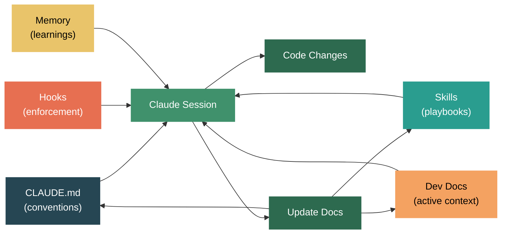

Claude Code as Your Team's Knowledge Layer — CLAUDE.md, Hooks, Skills, and the Onboarding Problem

Think about what happens when a new developer joins your team. There's a knowledge transfer session — someone walks them through the architecture, the coding conventions, the "we tried X but it didn't work" stories. They get pointed to documentation that may or may not be up to date. They spend weeks absorbing tribal knowledge that lives in people's heads and Slack threads.

Now think about what happens when you start a new Claude Code session. It reads your CLAUDE.md, loads your hooks, discovers your skills, checks its memory. In seconds, it has context that took the new developer weeks to build. The interesting part isn't that Claude Code can do this — it's that the infrastructure you build for Claude Code is the exact same infrastructure your team needs for onboarding.

Much of what I'll describe here was inspired by [a fantastic Reddit post by u/JokeGold5455 [1]](https://www.reddit.com/r/ClaudeCode/comments/1oivs81/claude_code_is_a_beast_tips_from_6_months_of/) — a software engineer who solo-rewrote a ~100K LOC internal tool into ~300K LOC over 6 months using Claude Code on the $200/month Max plan. They extracted their patterns into an [open-source showcase repo [2]](https://github.com/diet103/claude-code-infrastructure-showcase) that's one of the best references I've found for production Claude Code usage. I'll build on their patterns and connect them to the official [Claude Code documentation [3]](https://docs.anthropic.com/en/docs/claude-code/overview).

This post is about treating Claude Code not just as a coding assistant, but as a forcing function for documenting and enforcing your team's knowledge. The features map directly:

| Team Need | Traditional Approach | Claude Code Feature |
|---|---|---|
| Coding conventions | Wiki page (often stale) | CLAUDE.md |
| Code review standards | Reviewer memory | Hooks (pre/post tool) |
| Common workflows | Tribal knowledge | Skills (slash commands) |
| Architecture context | Onboarding doc (outdated by week 2) | Memory + Rules |
| "Don't do X" guardrails | PR review comments | PreToolUse hooks |


Let me walk through each feature and how it maps to team knowledge.

[CLAUDE.md [4]](https://docs.anthropic.com/en/docs/claude-code/memory) is the most straightforward: it's a markdown file that Claude reads at the start of every session. Put it in your repo root, and it becomes your project's instruction manual. But the key insight is the layering system:

| Scope | Location | Who writes it | Shared? |
|---|---|---|---|
| Project | `./CLAUDE.md` | Team (committed to repo) | Yes |
| Rules | `.claude/rules/*.md` | Team (committed to repo) | Yes |
| Local | `./CLAUDE.local.md` | Individual (gitignored) | No |
| User | `~/.claude/CLAUDE.md` | Individual | No |

The project CLAUDE.md is your team's coding conventions — committed, version-controlled, reviewed in PRs just like code. When someone updates the convention, everyone (including Claude) gets it in the next pull. Rules files let you split by topic: `code-style.md`, `testing.md`, `security.md`. Path-specific rules mean your API team's conventions only load when Claude is working on API files:

```yaml
# .claude/rules/api-conventions.md
---
paths:
  - "src/api/**/*.ts"
---

All API endpoints must:
- Validate input with Zod schemas
- Return standard error format { error: string, code: number }
- Include request ID in response headers
```

CLAUDE.local.md is for personal preferences that don't belong in the shared repo — your editor setup, your preferred test runner flags, your "I like verbose commit messages" rule. The layering means team standards and personal preferences coexist without conflicts.

Here's the practical recommendation: keep CLAUDE.md under 200 lines. It loads into every session, and bloated instructions reduce adherence. Move detailed content into [`.claude/rules/` files [5]](https://docs.anthropic.com/en/docs/claude-code/memory#organize-instructions-with-claude-rules) — they load on demand based on what files Claude is working with.


[Hooks [6]](https://docs.anthropic.com/en/docs/claude-code/hooks) are where things get interesting. They're shell commands that execute at specific points in Claude's workflow — deterministic automation, not suggestions. The distinction matters: you're not asking Claude to remember to run the linter, you're guaranteeing it runs.

```json
{
  "hooks": {
    "PreToolUse": [
      {
        "matcher": "Bash",
        "hooks": [
          {
            "type": "command",
            "command": "echo '{\"hookSpecificOutput\":{\"hookEventName\":\"PreToolUse\",\"permissionDecision\":\"deny\",\"permissionDecisionReason\":\"Use grep tool instead of bash grep\"}}' | jq -e '.hookSpecificOutput.permissionDecision' > /dev/null && cat"
          }
        ]
      }
    ],
    "PostToolUse": [
      {
        "matcher": "Edit|Write",
        "hooks": [
          {
            "type": "command",
            "command": "npx prettier --write \"$(cat /dev/stdin | jq -r '.tool_input.file_path')\""
          }
        ]
      }
    ]
  }
}
```

The hook types map to different team needs:

| Hook Event | When it fires | Team use case |
|---|---|---|
| PreToolUse | Before a tool runs | Block unsafe operations, enforce tool preferences |
| PostToolUse | After a tool succeeds | Auto-format, lint, log changes |
| UserPromptSubmit | When you send a prompt | Inject context, activate relevant skills |
| Stop | When Claude finishes responding | Run tests, check types, verify builds |

The [UserPromptSubmit hook is particularly clever [2]](https://github.com/diet103/claude-code-infrastructure-showcase). It reads your prompt, matches it against keyword/regex patterns, and injects relevant skill suggestions before Claude processes the prompt. This solves the problem that skills don't auto-activate reliably — the hook makes activation deterministic.

One important caveat from [u/JokeGold5455's experience [1]](https://www.reddit.com/r/ClaudeCode/comments/1oivs81/claude_code_is_a_beast_tips_from_6_months_of/): be careful with PostToolUse hooks that modify files. Each file modification triggers a system reminder with the diff, which consumes context tokens. A Prettier hook that runs on every edit can eat 160K tokens in just a few rounds. Use Stop hooks for non-blocking checks instead — they run once when Claude finishes, not on every edit.

Hooks receive JSON on stdin with the event details (tool name, inputs, session ID, working directory) and communicate back through exit codes: 0 means proceed, 2 means block. This lets you build sophisticated guardrails:

```python
#!/usr/bin/env python3
# .claude/hooks/check-env-files.py
# Blocks edits to .env files
import sys, json

event = json.load(sys.stdin)
file_path = event.get("tool_input", {}).get("file_path", "")

if ".env" in file_path and not file_path.endswith(".env.example"):
    print("Blocked: do not edit .env files directly. Use .env.example.", file=sys.stderr)
    sys.exit(2)
```


[Skills [7]](https://docs.anthropic.com/en/docs/claude-code/skills) are markdown files that extend Claude's capabilities with custom slash commands. Think of them as your team's playbooks — documented procedures that Claude follows step by step.

```yaml
# .claude/skills/deploy/SKILL.md
---
name: deploy
description: Deploy to staging or production environment
disable-model-invocation: true
---

Deploy to $1 environment:

1. Run the test suite: `npm test`
2. Build the project: `npm run build`
3. Check for uncommitted changes
4. If deploying to production, require explicit confirmation
5. Run: `./scripts/deploy.sh $1`
6. Verify health check at the deployed URL
7. Report deployment status
```

The directory structure matters. [The recommended pattern [2]](https://github.com/diet103/claude-code-infrastructure-showcase) keeps each skill under 500 lines with progressive disclosure:

```
.claude/skills/
  backend-dev/
    SKILL.md              # Overview + navigation (<500 lines)
    resources/
      api-patterns.md     # Deep dive on API patterns
      db-migrations.md    # Database migration guide
      error-handling.md   # Error handling conventions
  frontend-dev/
    SKILL.md
    resources/
      component-patterns.md
      state-management.md
```

Claude loads the main SKILL.md first, then pulls resource files only when needed. This improved token efficiency 40-60% compared to monolithic skill files.

Key configuration options:

| Option | Purpose | Example |
|---|---|---|
| `disable-model-invocation: true` | Only you can trigger (deploys, commits) | Prevents accidental deploys |
| `user-invocable: false` | Only Claude can trigger | Background knowledge |
| `context: fork` | Runs in isolated subagent context | Heavy tasks that would bloat main context |
| `paths: ["src/**/*.ts"]` | Only loads for matching files | Language-specific conventions |

Skills can also inject dynamic context using shell commands:

```yaml
---
name: pr-review
description: Review current pull request
---

## PR Context
- Diff: !`gh pr diff`
- Files changed: !`gh pr diff --name-only`

Review this PR for: code style, test coverage, security issues.
```

The `!` backtick syntax runs the command before Claude sees the prompt. The PR diff is injected directly into the skill context.


The [memory system [4]](https://docs.anthropic.com/en/docs/claude-code/memory) is Claude's own notes — things it learns during conversations and persists for future sessions. It's stored in `~/.claude/projects/<project>/memory/` and automatically loaded at the start of each session (first 200 lines of MEMORY.md).

This is different from CLAUDE.md. CLAUDE.md is what you tell Claude. Memory is what Claude tells itself. The distinction matters for team knowledge:

| What | Where to put it | Why |
|---|---|---|
| "Always use 2-space indent" | CLAUDE.md | Team convention, you define it |
| "This project uses direnv, run `direnv allow`" | Memory | Claude learned it, reminds itself |
| "User prefers terse responses" | Memory | Personal preference, not a project rule |
| "API routes live in src/api/handlers/" | CLAUDE.md or rules/ | Project structure, should be explicit |


Now here's the part that ties it all together: the documentation lifecycle.

The traditional problem with team documentation is that it goes stale. Someone writes an architecture doc, it's accurate for a month, then the code drifts and nobody updates the doc. This is why tribal knowledge exists — the real conventions live in people's heads because the written docs can't be trusted.

Claude Code changes this dynamic because the documentation isn't just for humans — it's for your coding assistant too. When CLAUDE.md is wrong, Claude does the wrong thing. When a hook is misconfigured, builds break. When a skill is outdated, workflows fail. The documentation has an immediate feedback loop with code production, which means it actually gets maintained.

The [dev-docs pattern from u/JokeGold5455 [1]](https://www.reddit.com/r/ClaudeCode/comments/1oivs81/claude_code_is_a_beast_tips_from_6_months_of/) makes this explicit. For every large task, create three files:

```
dev/active/feature-name/
  plan.md      # Strategic plan — what we're building and why
  context.md   # Key files, decisions, dependencies
  tasks.md     # Checklist of remaining work
```

These survive context resets and session boundaries. When you hit 15% remaining context, update the dev docs, compact, and say "continue" — Claude picks up exactly where it left off. This is essentially the same pattern as writing a handoff document for a colleague, except the colleague is your next Claude session.




Here's a practical setup for a team adopting Claude Code:

Step 1: Start with CLAUDE.md. Document your build commands, test commands, coding conventions. Keep it under 200 lines. Commit it. This alone is worth doing even if you never use Claude Code — it's the onboarding doc your team already needs.

Step 2: Add rules for specifics. Split into `.claude/rules/` by topic. Use path-specific rules for different parts of the codebase. Your API team's conventions don't need to load when someone's working on the frontend.

Step 3: Add hooks for enforcement. Start with PostToolUse formatting (but on Stop, not per-edit). Add PreToolUse guardrails for things that should never happen — editing .env files, running destructive commands, bypassing tests.

Step 4: Build skills for repeating workflows. Deploy procedures, PR review checklists, debugging runbooks. These are your team's playbooks, executable by Claude.

Step 5: Let memory accumulate naturally. Don't try to pre-populate it. Let Claude learn your project's quirks over time — the build command that needs a special flag, the test that's flaky on CI, the module that has a surprising dependency.

The [diet103/claude-code-infrastructure-showcase [2]](https://github.com/diet103/claude-code-infrastructure-showcase) repo is an excellent reference for all of this — it's a real-world extraction from 6 months of production use on a ~300K LOC TypeScript project. The author (u/JokeGold5455 on Reddit) spent $1,200 total over 6 months on the Max plan and [shared their complete methodology [1]](https://www.reddit.com/r/ClaudeCode/comments/1oivs81/claude_code_is_a_beast_tips_from_6_months_of/). Their key insight: skills alone don't work because Claude doesn't reliably auto-activate them. The UserPromptSubmit hook that matches prompts to skills and injects suggestions is the glue that makes the whole system reliable.


The meta-insight is this: the infrastructure you build to make Claude Code effective is the same infrastructure that makes your team effective. CLAUDE.md is your coding standards doc. Hooks are your CI checks running locally. Skills are your team's runbooks. Memory is institutional knowledge.

If you keep these up to date — and you will, because Claude breaks when they're wrong — you've solved the documentation problem not by trying harder to write docs, but by making documentation a load-bearing part of your development workflow. The new developer who joins your team doesn't just get a stale wiki page. They get a working system that actively guides their coding assistant (and by extension, them) toward the team's conventions.

The coding assistant isn't just a tool. It's a forcing function for the practices you already know you should have.

How are you structuring your Claude Code setup for team workflows?


References:

[1] u/JokeGold5455. ["Claude Code is a Beast — Tips from 6 Months of Hardcore Use."](https://www.reddit.com/r/ClaudeCode/comments/1oivs81/claude_code_is_a_beast_tips_from_6_months_of/) r/ClaudeCode 2025.  
[2] diet103. ["claude-code-infrastructure-showcase."](https://github.com/diet103/claude-code-infrastructure-showcase) GitHub.  
[3] ["Claude Code Overview."](https://docs.anthropic.com/en/docs/claude-code/overview) Anthropic.  
[4] ["Claude Code — Memory, CLAUDE.md, and .claude/rules."](https://docs.anthropic.com/en/docs/claude-code/memory) Anthropic.  
[5] ["Organize Instructions with .claude/rules."](https://docs.anthropic.com/en/docs/claude-code/memory#organize-instructions-with-claude-rules) Anthropic.  
[6] ["Claude Code — Hooks."](https://docs.anthropic.com/en/docs/claude-code/hooks) Anthropic.  
[7] ["Claude Code — Skills."](https://docs.anthropic.com/en/docs/claude-code/skills) Anthropic.  
[8] ["Claude Code — Sub-agents."](https://docs.anthropic.com/en/docs/claude-code/sub-agents) Anthropic.  
[9] ["Claude Code — Settings."](https://docs.anthropic.com/en/docs/claude-code/settings) Anthropic.  
[10] ["Claude Code — Context Window Management."](https://docs.anthropic.com/en/docs/claude-code/context-window) Anthropic.  
[11] ["Claude Code — Best Practices."](https://docs.anthropic.com/en/docs/claude-code/best-practices) Anthropic.  
