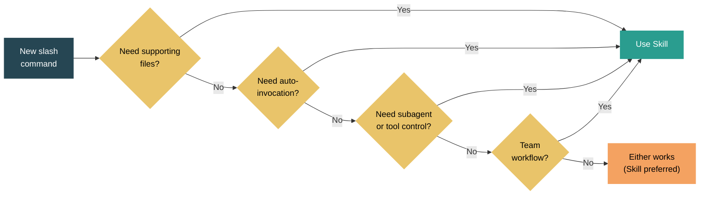

Skills vs Custom Commands in Claude Code — When to Use Which

If you've been building workflows in Claude Code, you've probably noticed two ways to create slash commands: Skills (`.claude/skills/<name>/SKILL.md`) and Custom Commands (`.claude/commands/<name>.md`). They both create `/name` in the slash menu. They both accept `$ARGUMENTS`. So what's the difference, and when should you use each?

The short answer: custom commands are the legacy format. Skills are the current standard and a strict superset. [The official docs [1]](https://docs.anthropic.com/en/docs/claude-code/skills) are explicit about this — "Custom commands have been merged into skills. Your existing `.claude/commands/` files keep working. Skills add optional features." But the longer answer is more nuanced, because "strictly better" doesn't always mean "always use the complex option."

Let me start with what they share. Both are markdown files with optional YAML frontmatter. Both create slash commands. Both support `$ARGUMENTS` substitution. Both can live at project scope (`.claude/`) or personal scope (`~/.claude/`). If all you need is a simple prompt template — a `/review` that injects your team's review checklist, a `/deploy` that runs a deployment script — both work identically:

```yaml
# Works the same as .claude/commands/review.md
# OR .claude/skills/review/SKILL.md
---
name: review
description: Review code against team standards
disable-model-invocation: true
---

Review the current changes against these standards:
1. All functions have type annotations
2. No hardcoded secrets
3. Tests cover the happy path and one edge case
```

The divergence starts when you need anything beyond a simple prompt template. Here's where Skills pull ahead:

| Capability | Custom Commands | Skills |
|---|---|---|
| Simple slash command | Yes | Yes |
| YAML frontmatter | Yes (subset) | Yes (full) |
| `$ARGUMENTS` substitution | Yes | Yes |
| Supporting files (templates, scripts) | No — single file only | Yes — full directory |
| Auto-invocation by Claude | No | Yes — description matching |
| Subagent execution (`context: fork`) | No | Yes |
| Tool access control (`allowed-tools`) | No | Yes |
| Dynamic context injection (`` !`cmd` ``) | No | Yes |
| Path-specific activation (`paths:`) | No | Yes |
| Model/effort override | No | Yes |
| Live discovery (edit without restart) | No | Yes |
| Invocation control | Limited | Full (`disable-model-invocation`, `user-invocable`) |


Let me walk through the capabilities that matter most.

**Supporting files** are the most practical difference. A custom command is a single `.md` file. A skill is a directory. This means a skill can include templates, examples, scripts, and reference docs alongside the main SKILL.md:

```
.claude/skills/api-design/
  SKILL.md              # Main instructions (<500 lines)
  resources/
    patterns.md         # API design patterns reference
    error-codes.md      # Standard error code catalog
    template.ts         # Starter template for new endpoints
```

Claude loads SKILL.md first, then pulls resource files on demand. This is the [progressive disclosure pattern from u/JokeGold5455's showcase [2]](https://github.com/diet103/claude-code-infrastructure-showcase) — keep the entry point under 500 lines and let Claude dig deeper only when needed. With custom commands, you'd have to cram everything into one file or reference files by path and hope Claude reads them.

**Auto-invocation** is the most conceptually interesting difference. Skills have a `description` field that Claude uses to decide whether to load the skill automatically. If your skill says `description: Explains code with diagrams and analogies`, and the user asks "how does this work?", Claude may auto-load it without anyone typing `/explain`. Custom commands only activate when explicitly invoked.

This is powerful but comes with a caveat from [practical experience [2]](https://github.com/diet103/claude-code-infrastructure-showcase): auto-invocation isn't 100% reliable. That's why the UserPromptSubmit hook pattern exists — a hook that matches your prompt against keywords and injects skill suggestions deterministically. If you depend on auto-invocation for critical workflows, back it up with a hook.

You can also go the other direction: `disable-model-invocation: true` means only the user can trigger it (good for `/deploy` — you don't want Claude deciding to deploy on its own). `user-invocable: false` means only Claude can trigger it (good for background knowledge that shouldn't clutter the slash menu).

**Subagent execution** (`context: fork`) is a skill-only feature that solves the context window problem. Heavy tasks — deep code research, large file analysis, comprehensive reviews — can bloat your main conversation context. With `context: fork`, the skill runs in an isolated subagent with its own context window:

```yaml
# .claude/skills/deep-research/SKILL.md
---
name: deep-research
description: Thoroughly research a codebase topic
context: fork
agent: Explore
allowed-tools: Read Grep Glob
---

Research $ARGUMENTS thoroughly:
1. Find all relevant files
2. Read and analyze the code
3. Summarize findings with specific file:line references
```

The subagent does the heavy lifting, returns a summary, and your main context stays clean. You can even specify which agent type to use (`Explore` for research, `Plan` for architecture).

**Dynamic context injection** with the `` !`command` `` syntax runs shell commands before Claude sees the prompt. This is subtle but powerful:

```yaml
---
name: pr-review
description: Review the current pull request
---

## Current PR Context
- Diff: !`gh pr diff`
- Changed files: !`gh pr diff --name-only`
- PR description: !`gh pr view --json body -q .body`

Review against team standards...
```

The shell commands execute when the skill loads, and their output becomes part of the prompt. No custom commands equivalent exists.


So when should you still use custom commands? Honestly, almost never for new work. But there are two cases where they're reasonable:

First, **migration cost**. If you have a `.claude/commands/` directory full of working commands, there's no urgency to migrate. They'll keep working. Migrate when you need a skill-specific feature for that particular command.

Second, **simplicity preference**. If you're building a quick personal command — a `/scratch` that opens a scratchpad, a `/standup` that formats your daily update — the single-file format is slightly more convenient than creating a directory with a SKILL.md inside it. The difference is trivial, but it's there.

For everything else — team workflows, complex procedures, anything that benefits from supporting files or invocation control — skills are the clear choice.


Here's a decision flowchart:




A practical migration looks like this. Say you have a custom command at `.claude/commands/deploy.md`:

```yaml
---
description: Deploy to environment
disable-model-invocation: true
---

Deploy $ARGUMENTS:
1. Run tests
2. Build
3. Deploy to $1
```

The skill version at `.claude/skills/deploy/SKILL.md`:

```yaml
---
name: deploy
description: Deploy to staging or production environment
disable-model-invocation: true
allowed-tools: Bash(npm *) Bash(./scripts/deploy*)
---

Deploy to $1 environment:
1. Run test suite: `npm test`
2. Build: `npm run build`
3. Check for uncommitted changes
4. If deploying to production, require explicit confirmation
5. Run: `./scripts/deploy.sh $1`
6. Verify health check

## Environment configs
!`cat ./deploy/environments.json`
```

The skill version adds tool access control (only specific bash commands allowed), dynamic context injection (environment configs loaded at invocation time), and lives in a directory where you could add a `resources/runbook.md` or `scripts/healthcheck.sh` later.

One important note: if a skill and a custom command share the same name, the skill takes precedence. So you can migrate incrementally — create the skill, verify it works, then delete the old command file.


The bottom line: custom commands are training wheels. They got the concept right — markdown files that create slash commands — but skills are the evolved version with the full feature set. For new work, default to skills. For existing commands, migrate when you need a feature that commands can't provide.

The real power isn't in either format individually. It's in combining skills with [hooks [3]](https://docs.anthropic.com/en/docs/claude-code/hooks) for deterministic activation, with [CLAUDE.md [4]](https://docs.anthropic.com/en/docs/claude-code/memory) for conventions, and with [memory [4]](https://docs.anthropic.com/en/docs/claude-code/memory) for learned context. Skills are one piece of the [knowledge layer I described in my previous post [5]](https://dangquan1402.github.io/llm-engineering-notes/2026/04/03/claude-code-as-team-knowledge.html) — the playbook component that turns tribal knowledge into executable workflows.

What's your experience been with skills vs commands? Have you found cases where the simpler format is genuinely better?


References:

[1] ["Claude Code — Skills."](https://docs.anthropic.com/en/docs/claude-code/skills) Anthropic.  
[2] diet103. ["claude-code-infrastructure-showcase."](https://github.com/diet103/claude-code-infrastructure-showcase) GitHub.  
[3] ["Claude Code — Hooks."](https://docs.anthropic.com/en/docs/claude-code/hooks) Anthropic.  
[4] ["Claude Code — Memory, CLAUDE.md, and .claude/rules."](https://docs.anthropic.com/en/docs/claude-code/memory) Anthropic.  
[5] Dang, Q. ["Claude Code as Your Team's Knowledge Layer."](https://dangquan1402.github.io/llm-engineering-notes/2026/04/03/claude-code-as-team-knowledge.html) Community Contributor Posts 2026.  
