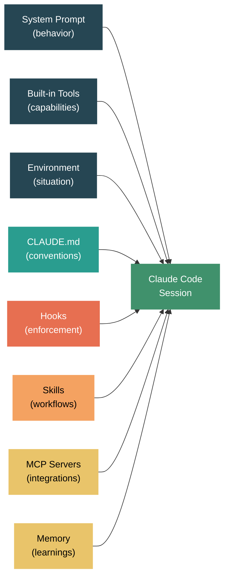

Anatomy of a Claude Code Session — What's Built-in, What's Configurable, and What You Control

Every time you launch Claude Code, a small orchestra of context layers assembles before you type a single character. The system prompt loads. Built-in tools register. Your CLAUDE.md files get read. Skills discover themselves. MCP servers connect. Memory loads from previous sessions. All of this happens in seconds, and most of it is invisible.

I got curious about what exactly shapes a Claude Code session — not from the docs, but from the inside. What's hardcoded by Anthropic? What's on by default but configurable? What's purely opt-in? Understanding these layers matters because it tells you where to invest your customization effort. You wouldn't try to override the system prompt (you can't), and you wouldn't skip CLAUDE.md (it's the highest-leverage thing you control).

This post maps the full stack of context that shapes Claude Code's behavior, from the innermost layer you can't touch to the outermost layer that's entirely yours.


Here's the layered architecture at a glance:

| Layer | Who controls it | Default? | Can disable? |
|---|---|---|---|
| System prompt | Anthropic | Always on | No |
| Built-in tools | Anthropic + you (permissions) | Always on | Partially (permission modes) |
| Environment context | Auto-detected | Always on | No |
| CLAUDE.md files | You (team + personal) | Loaded when present | Don't create the file |
| Settings (settings.json) | You | Defaults apply | Yes — override per key |
| Hooks | You | Off (opt-in) | Yes — remove from settings |
| Skills | You | Discovered when present | Yes — `user-invocable: false` |
| MCP servers | You | Off (opt-in) | Yes — remove from settings |
| Memory | Claude (you direct) | On when configured | Yes — delete memory files |


Let me walk through each layer.


**Layer 1: The System Prompt**

This is the foundation — a large set of instructions that Anthropic injects at the start of every session. You never see it directly (unless you [ask Claude to reflect on it [1]](https://simonwillison.net/2025/Jun/14/claude-code-system-prompt/), or extract it through prompt injection research). It covers:

- Core behavioral instructions — how to approach tasks, when to ask for confirmation, how to handle errors
- Tool usage guidelines — "use Read instead of cat," "use Grep instead of rg," specific protocols for each tool
- Safety rules — what to refuse, how to handle destructive operations, when to confirm before acting
- Git protocols — detailed step-by-step instructions for commits and PRs (this is why Claude Code's git workflow is so consistent)
- Output style — "go straight to the point," "keep responses short and concise," "don't add features beyond what was asked"
- Security awareness — OWASP top 10, command injection prevention, credential handling

The system prompt is substantial — thousands of tokens of carefully tuned instructions. It's why Claude Code behaves differently from raw Claude in the API. You can't modify it, but understanding it explains a lot of Claude Code's default behaviors. For example, the reason Claude Code always uses `Read` instead of `cat` isn't a learned preference — it's an explicit instruction in the system prompt.

One important detail: the system prompt includes a "do not overdo it" philosophy. It explicitly says not to add docstrings, comments, or type annotations to code you didn't change. Not to add error handling for impossible scenarios. Not to create abstractions for one-time operations. If you've noticed Claude Code being more restrained than raw Claude, this is why.


**Layer 2: Built-in Tools**

Claude Code ships with a fixed set of tools that are always available:

| Tool | Purpose |
|---|---|
| `Read` | Read files (text, images, PDFs, notebooks) |
| `Write` | Create new files or complete rewrites |
| `Edit` | Exact string replacements in existing files |
| `Bash` | Execute shell commands |
| `Grep` | Search file contents (ripgrep-powered) |
| `Glob` | Find files by pattern |
| `Agent` | Spawn sub-agents for complex tasks |
| `Skill` | Invoke user-defined skills |
| `ToolSearch` | Discover deferred/MCP tools |

These tools are always registered — you can't remove them. But you control *access* through [permission modes [2]](https://docs.anthropic.com/en/docs/claude-code/settings):

| Mode | Behavior |
|---|---|
| `default` | Prompts for approval on potentially risky operations |
| `auto` | Auto-approves most operations (still blocks destructive ones) |
| `plan` | Requires plan approval before execution |
| `bypassPermissions` | No prompts (use with caution) |

You can also set per-tool permissions in `settings.json`:

```json
{
  "permissions": {
    "allow": ["Read", "Grep", "Glob"],
    "deny": ["Bash(rm *)"]
  }
}
```

The permission system is granular — you can allow `Bash` generally but deny specific patterns like `Bash(rm -rf)` or `Bash(git push --force)`. This is the first layer where your configuration intersects with Anthropic's defaults.


**Layer 3: Environment Context**

Before you type anything, Claude Code auto-detects and injects environment information:

- Working directory and whether it's a git repo
- Current git branch, recent commits, and git status (staged/unstaged changes)
- Platform (macOS, Linux), shell (bash, zsh), OS version
- Current model name and context window size
- Current date

This is why Claude Code knows your branch name, can reference recent commits, and adapts commands to your OS. It's always on, always fresh per session. You don't configure it — it's automatic context that makes Claude Code situationally aware.


**Layer 4: CLAUDE.md — The Layer You Should Invest In Most**

This is the highest-leverage customization point. Claude Code reads markdown instruction files from multiple locations, layered by scope:

| Scope | Location | Shared with team? | Loaded when? |
|---|---|---|---|
| User (global) | `~/.claude/CLAUDE.md` | No | Every session |
| Project | `./CLAUDE.md` | Yes (committed) | When in project dir |
| Project local | `./CLAUDE.local.md` | No (gitignored) | When in project dir |
| Rules | `.claude/rules/*.md` | Yes (committed) | Based on file paths |

All of these load automatically when they exist. You "disable" them by not having the file. The layering means:

- Team conventions go in `./CLAUDE.md` — committed, version-controlled, reviewed in PRs
- Personal preferences go in `~/.claude/CLAUDE.md` or `./CLAUDE.local.md` — never shared
- Topic-specific rules go in `.claude/rules/` — loaded on demand based on which files Claude is working with
- Path-specific rules use frontmatter to scope activation:

```yaml
# .claude/rules/api-conventions.md
---
paths:
  - "src/api/**/*.ts"
---

All API endpoints must validate input with Zod schemas.
```

This layering is powerful because it separates concerns. Your team's "always use 2-space indent" lives in the project CLAUDE.md. Your personal "I prefer verbose explanations" lives in your global CLAUDE.md. The API team's conventions only load when Claude touches API files.

The practical recommendation from [experienced users [3]](https://www.reddit.com/r/ClaudeCode/comments/1oivs81/claude_code_is_a_beast_tips_from_6_months_of/): keep the main CLAUDE.md under 200 lines. It loads into every session, and bloated instructions reduce adherence. Push details into rules files.


**Layer 5: Settings (settings.json)**

The meta-configuration layer. Settings control permissions, hooks, MCP servers, model preferences, and more. They follow the same global/project layering:

| Scope | Location |
|---|---|
| Global | `~/.claude/settings.json` |
| Project (shared) | `.claude/settings.json` |
| Project (local) | `.claude/settings.local.json` |

Settings are merged with project settings taking precedence over global. Key things you configure here:

```json
{
  "permissions": {
    "allow": ["Read", "Grep", "Glob", "Edit"],
    "deny": ["Bash(curl*)"]
  },
  "hooks": {
    "PostToolUse": [...]
  },
  "mcpServers": {
    "my-server": { "command": "npx", "args": ["my-mcp-server"] }
  },
  "env": {
    "ANTHROPIC_MODEL": "claude-sonnet-4-6-20250514"
  }
}
```

Defaults apply when no settings file exists. This is the control plane for everything else — hooks, MCP, and permissions are all configured here.


**Layer 6: Hooks — Deterministic Automation (Opt-in)**

[Hooks [4]](https://docs.anthropic.com/en/docs/claude-code/hooks) are shell commands that execute at specific points in Claude's workflow. They're completely opt-in — nothing runs until you configure it in `settings.json`.

| Hook Event | When it fires | Use case |
|---|---|---|
| `PreToolUse` | Before a tool runs | Block unsafe operations, enforce tool preferences |
| `PostToolUse` | After a tool succeeds | Auto-format, lint, log changes |
| `UserPromptSubmit` | When you send a prompt | Inject context, route to skills |
| `Stop` | When Claude finishes responding | Run tests, type-check, verify builds |
| `SubagentStop` | When a sub-agent finishes | Validate sub-agent output |

The key distinction: hooks are *deterministic*. You're not asking Claude to remember to run the linter — you're guaranteeing it runs. A PreToolUse hook can block an operation (exit code 2) or modify it. A PostToolUse hook can transform output.

Hooks are configured in `settings.json` with matchers that filter by tool name:

```json
{
  "hooks": {
    "PreToolUse": [{
      "matcher": "Bash",
      "hooks": [{
        "type": "command",
        "command": "python3 .claude/hooks/check-command.py"
      }]
    }]
  }
}
```

Default: nothing. This is pure opt-in. But once configured, hooks are the most reliable enforcement mechanism — more reliable than instructions in CLAUDE.md, because they execute as code, not as suggestions.


**Layer 7: Skills — Custom Slash Commands (Discovered When Present)**

[Skills [5]](https://docs.anthropic.com/en/docs/claude-code/skills) are markdown files that create slash commands. They live in `.claude/skills/<name>/SKILL.md` (project) or `~/.claude/skills/<name>/SKILL.md` (personal).

Skills are *discovered automatically* when the directory exists — you don't need to register them anywhere. But they have fine-grained activation controls:

| Control | What it does | Default |
|---|---|---|
| `user-invocable: true` | Shows in slash menu for manual invocation | true |
| `disable-model-invocation: true` | Prevents Claude from auto-activating | false |
| `paths: ["src/**"]` | Only activates for matching files | none (always available) |
| `context: fork` | Runs in isolated sub-agent | false (runs in main context) |

The interesting design choice: skills can be model-invocable by default. If you create a skill with `description: "Explains code architecture"` and ask Claude "how does this work?", Claude may auto-activate it. This is powerful but [not 100% reliable [3]](https://www.reddit.com/r/ClaudeCode/comments/1oivs81/claude_code_is_a_beast_tips_from_6_months_of/) — which is why the UserPromptSubmit hook pattern exists as a deterministic fallback.

You can also have skills that are *only* model-invocable (`user-invocable: false`) — background knowledge that Claude uses when relevant but doesn't clutter your slash menu.


**Layer 8: MCP Servers — External Tool Integrations (Opt-in)**

[Model Context Protocol (MCP) servers [6]](https://docs.anthropic.com/en/docs/claude-code/mcp-servers) extend Claude Code with external tools — browser automation, database access, Figma integration, Jira, Slack, and anything else with an MCP adapter.

MCP servers are purely opt-in. You configure them in `settings.json`:

```json
{
  "mcpServers": {
    "playwright": {
      "command": "npx",
      "args": ["@anthropic-ai/mcp-playwright"]
    },
    "github": {
      "command": "npx",
      "args": ["@anthropic-ai/mcp-github"],
      "env": { "GITHUB_TOKEN": "..." }
    }
  }
}
```

Once configured, MCP tools appear alongside built-in tools. Claude discovers them via `ToolSearch` (deferred loading — they don't all load at session start, which saves context tokens). The tools follow the same permission model as built-in tools.

MCP servers can be scoped globally or per-project, just like settings. A team can commit `.claude/settings.json` with project-specific MCP servers that everyone gets automatically.


**Layer 9: Memory — Claude's Own Notes (Auto When Configured)**

The [memory system [7]](https://docs.anthropic.com/en/docs/claude-code/memory) is Claude's persistent notes across sessions. It's stored in `~/.claude/projects/<project-hash>/memory/` with a `MEMORY.md` index file.

Memory is a hybrid: the *system* is always available, but it only contains content if Claude (or you) have written to it. Memory accumulates naturally — Claude saves things it learns during conversations: your preferences, project quirks, debugging findings.

The first 200 lines of `MEMORY.md` load automatically at session start. Memory types include:

| Type | What it captures | Example |
|---|---|---|
| `user` | Your role, preferences, expertise | "Senior engineer, prefers terse output" |
| `feedback` | Corrections and confirmations | "Don't mock the database in tests" |
| `project` | Ongoing work context | "Merge freeze starts April 5 for release" |
| `reference` | Pointers to external systems | "Bugs tracked in Linear project INGEST" |

You can explicitly ask Claude to remember or forget things. You can also directly edit the memory files — they're just markdown.

Default: the memory infrastructure exists, but it's empty until populated. It's not opt-in (you don't need to enable it), but it's also not pre-populated. Think of it as an empty notebook that's always in Claude's pocket.


Now here's what makes this interesting — the layers compose.

A CLAUDE.md instruction says "always run tests before committing." A PostToolUse hook on `Write|Edit` auto-formats code. A skill provides the `/deploy` workflow. A memory entry notes that your test suite needs `--experimental-vm-modules` flag. An MCP server gives Claude access to your Jira board for context.

Each layer handles a different kind of knowledge:



The dark teal nodes are Anthropic-controlled (you can't change them). The green/orange/yellow nodes are yours.


Here's a practical decision framework for where to put what:

| You want to... | Put it in... | Why |
|---|---|---|
| Set coding conventions for the team | `./CLAUDE.md` or `.claude/rules/` | Version-controlled, shared |
| Set personal preferences | `~/.claude/CLAUDE.md` | Applies to all projects |
| Guarantee a check runs | Hooks in `settings.json` | Deterministic, not a suggestion |
| Create a reusable workflow | Skills (`.claude/skills/`) | Discoverable, parameterized |
| Add external tool access | MCP servers in `settings.json` | Extends capability |
| Record project learnings | Memory (let Claude save it) | Persists across sessions |
| Block dangerous operations | PreToolUse hook or permission deny rules | Hard enforcement |
| Scope rules to file types | `.claude/rules/*.md` with `paths:` frontmatter | Loads only when relevant |

The meta-principle: use instructions (CLAUDE.md) for guidance, hooks for enforcement, skills for workflows, and MCP for capabilities. Instructions can be ignored under pressure. Hooks can't.


One last observation. The system prompt contains a fascinating tension. It tells Claude to be helpful and complete tasks autonomously, but also to pause before destructive actions. It says to be concise, but also thorough when needed. It says to follow CLAUDE.md instructions, but also to use judgment. These tensions aren't bugs — they're deliberate design choices that create a system prompt which bends without breaking across wildly different use cases.

Understanding this tension helps you write better CLAUDE.md instructions. Don't fight the system prompt — work with it. If you want Claude to be more autonomous, adjust permission modes rather than writing "never ask for confirmation" in CLAUDE.md (the system prompt's safety instructions will override that anyway). If you want stricter enforcement, use hooks rather than emphatic CLAUDE.md instructions (Claude might still deviate under ambiguity).

The best Claude Code setups I've seen treat these layers as complementary, not competing. CLAUDE.md sets the direction. Hooks enforce the guardrails. Skills provide the playbooks. Memory accumulates the context. And the system prompt — the layer you can't touch — provides the behavioral foundation that makes all of it work.

What layer have you found most impactful for your workflow?


References:

[1] Simon Willison. ["Claude Code's system prompt."](https://simonwillison.net/2025/Jun/14/claude-code-system-prompt/) simonwillison.net 2025.  
[2] ["Claude Code — Settings."](https://docs.anthropic.com/en/docs/claude-code/settings) Anthropic.  
[3] u/JokeGold5455. ["Claude Code is a Beast — Tips from 6 Months of Hardcore Use."](https://www.reddit.com/r/ClaudeCode/comments/1oivs81/claude_code_is_a_beast_tips_from_6_months_of/) r/ClaudeCode 2025.  
[4] ["Claude Code — Hooks."](https://docs.anthropic.com/en/docs/claude-code/hooks) Anthropic.  
[5] ["Claude Code — Skills."](https://docs.anthropic.com/en/docs/claude-code/skills) Anthropic.  
[6] ["Claude Code — MCP Servers."](https://docs.anthropic.com/en/docs/claude-code/mcp-servers) Anthropic.  
[7] ["Claude Code — Memory, CLAUDE.md, and .claude/rules."](https://docs.anthropic.com/en/docs/claude-code/memory) Anthropic.  
[8] ["Claude Code — Overview."](https://docs.anthropic.com/en/docs/claude-code/overview) Anthropic.  
[9] ["Claude Code — Sub-agents."](https://docs.anthropic.com/en/docs/claude-code/sub-agents) Anthropic.  
